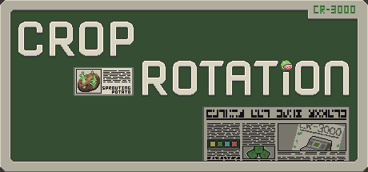

Solo Game Dev @ [Sprouting Potato](https://zwodahs.itch.io/)

- Check out my games on [Itch](https://zwodahs.itch.io/) or [Steam](https://store.steampowered.com/developer/Sprouting%20Potato)
- My game jams games are organised in this [collection](https://itch.io/c/1867456/game-jams)

# Released Games

## Crop Rotation (2023) | [Steam](https://s.team/a/2348090) | [Itch](https://zwodahs.itch.io/crop-rotation) (Web Demo Available) |

## Dice Tribes: Ambitions (2022) | [Steam](https://store.steampowered.com/app/1965800/Dice_Tribes_Ambitions/) | [Itch](https://zwodahs.itch.io/dice-tribes-ambitions) (Web Demo Available) |

# Dev Logs

You can find more dev logs in the public repo of the readme but here are some that are more evergreen.

## Crop Rotation
- Journey of Crop Rotation (Coming Soon)
- [Analysis of Crop Rotation and Production Engine Builders](devlog/croprotation/production-engine-builder.md)
